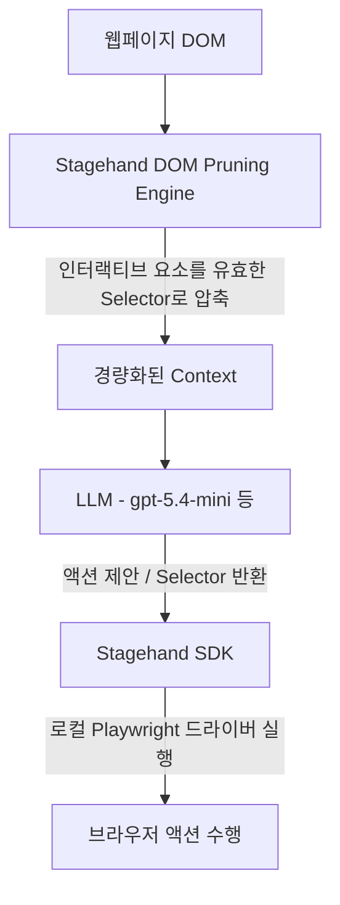

지난달 OpenAI API 영수증을 보고 내 눈을 의심했다. 

겨우 웹사이트 몇 개 돌아다니면서 데이터 좀 긁어오라고 에이전트 만들어놨더니, 내 한 달 치 치킨 값이 API 비용으로 증발했더라. 이유? 간단하다. Playwright에 LLM 붙여서 브라우저 제어할 때 무지성으로 `page.content()` 떠서 DOM 전체를 LLM에 던졌기 때문이다. `<div>` 지옥과 온갖 쓰레기 스크립트태그가 섞인 몇만 줄짜리 HTML을 매 행동마다 프롬프트로 들이부었으니 토큰이 안 터지고 배기겠나.

그러다 깃허브를 떠돌다 발견한 녀석이 바로 **Stagehand v4**다. 

"Playwright는 테스트용이고, Stagehand는 에이전트용이다"라는 당돌한 슬로건을 걸고 나왔다. 심지어 **속도 2배, 토큰 80% 절감**이란다. 약 파는 건지 진짜 물건인지 궁금해서 바로 뜯어봤다.

---

## 기존 브라우저 에이전트가 토큰을 처먹던 방식

기존에 LLM으로 브라우저를 조종하려면 대충 두 가지 방법을 썼다.

1. **스크린샷 방식**: 매 프레임 스크린샷 찍어서 VLM(Vision LLM)에 넘기기 ➔ *비용 폭탄 + 속도 답 없음*
2. **Raw HTML / DOM Dump 방식**: 현재 페이지 HTML 전체를 텍스트로 넘기기 ➔ *토큰 폭탄 + LLM이 환각 일으켜서 이상한 버튼 클릭함*


*▲ 분명 로컬에선 잘 돌아갔는데...?*


결국 문제는 **"LLM한테 브라우저 상태를 어떻게 효율적으로 보여줄 것인가"**다. Playwright는 원래 E2E 테스트용으로 만들어진 도구라, LLM이 이해하기 좋은 형태로 DOM을 정제해 주는 기능 따윈 없다. 실무 개발자가 직접 DOM 트리 깎는 장인이 되어야 했다.

Stagehand는 바로 이 지점을 파고들었다.

---

## Stagehand v4의 핵심 아키텍처: 세 가지 기둥 (`observe`, `act`, `extract`)

Stagehand의 동작 원리는 생각보다 명쾌하다. LLM에게 웹페이지 전체를 다 보여주지 않는다. 대신 **"경량화된 DOM 추상화"** 엔진을 중간에 둔다.



Stagehand는 개발자에게 세 가지 핵심 메서드를 제공한다.

### 1. `observe()` : 토큰 절감과 보안의 핵심
"로그인 버튼 찾아줘"라고 하면, LLM이 직접 클릭까지 하는 게 아니라 **해당 요소의 실제 Playwright Selector만 찾아준다.**

```typescript
// observe()는 진짜 CSS/Xpath Selector를 반환함
const { data: email } = await stagehand.observe("find the email input");
const { data: password } = await stagehand.observe("find the password input");

// 비밀번호 입력은 로컬 브라우저 드라이버에서 직접 처리!
// 즉, 내 비밀번호가 LLM API로 전송될 일이 전혀 없다.
await page.locator(email[0].selector).fill(process.env.APP_EMAIL!);
await page.locator(password[0].selector).fill(process.env.APP_PASSWORD!);
```
이 방식의 미친 점은 두 가지다.
* **보안**: 비밀번호나 개인정보를 LLM 프롬프트에 실어 보낼 필요가 없다.
* **토큰 절감**: DOM에서 클릭 가능한 핵심 요소를 미리 필터링(DOM Pruning)해서 LLM에 전달하므로 입력 토큰이 80% 이상 줄어든다.

### 2. `act()` : 자가 치유(Self-Healing) UI 액션
웹사이트 디자인이 바뀌어서 클래스명이 `btn-primary-v2`에서 `button-submit-new`로 개편되었다고 치자. 기존 맘대로 짜둔 스크립트는 터진다.하지만 Stagehand의 `act()`는 자연어로 명령을 받아서 알아서 재시도하고 찾아낸다.

```typescript
// 사이트 UI가 다 엎어져도 자연어 기반으로 알아서 치유해서 클릭함
await stagehand.act("click the sign in button");
await stagehand.act("open the billing page");
```

### 3. `extract()` : Zod 스키마 기반 타입 안전 추출
크롤링할 때 가장 귀찮은 게 RegEx나 Cheerio 붙여서 텍스트 파싱하는 거다. `extract()`는 Zod 스키마만 던져주면 알아서 JSON 구조로 딱 맞춰서 뽑아준다.

```typescript
const { data } = await stagehand.extract(
  "extract every invoice in the table",
  z.object({
    invoices: z.array(z.object({ 
      number: z.string(), 
      amount: z.number(), 
      paid: z.boolean() 
    })),
  }),
);

// data.invoices는 완벽히 타입이 추론된 배열이다.
console.log(data.invoices[0].amount);
```

---

## 2배 빠른 속도와 80% 토큰 절감이 진짜인가?

결론부터 말하면 **"조건부 진짜"**다.

기존에 LangChain + Playwright 조합이나 AutoGPT 계열 도구들이 페이지 하나 분석할 때마다 통째로 50k~100k 토큰씩 잡아먹던 것에 비하면, Stagehand의 DOM 경량화 알고리즘은 혁명 수준이다.


*▲ 새로운 오픈소스 라이브러리 스타 찍는 손가락*


1. **입력 토큰 감축**: DOM 트리를 분석해서 불필요한 `div`, `span`, CSS 스타일 정보, 메타태그를 전부 쳐내고 인터랙션 가능한 노드(AOM, Accessibility Object Model 기반)만 뽑아 프롬프트로 만든다. 여기서 토큰 80% 절감이 나온다.
2. **응답 속도 향상**: 프롬프트를 적게 먹으니 LLM의 첫 토큰 생성 시간(TTFT)이 비약적으로 줄어든다. 게다가 `observe()`를 통해 로컬 Playwright 코드로 실행을 위임하니까 네트워크 왕복 횟수가 최소화된다. 속도가 2배 빨라지는 건 어찌 보면 당연한 수학적 결과다.

게다가 TypeScript뿐만 아니라 **Python과 Go까지 지원**한다. 백엔드 파이프라인에 붙이기 매우 쾌적해졌다.

---

## 실무 개발자 입장에서 본 아쉬운 점 & 한계

찬양만 할 순 없다. 내 통장을 지켜줄 은인이긴 하지만, 여전히 한계는 존재한다.

* **복잡한 Canvas / Shadow DOM**: 캔버스 기반으로 그려진 차트나 complex한 Shadow DOM으로 꽁꽁 묶인 Enterprise ERP 시스템에서는 `observe()`가 요소를 놓치는 경우가 더러 있다.
* **LLM 의존성**: 아무리 DOM을 깎아도 결국 판단은 LLM(GPT-5.4-mini나 Claude 3.5 Sonnet 등)이 한다. 모델이 멍청한 날엔 여전히 엄한 곳을 클릭하려 든다.
* **Browserbase 로크인?**: 오픈소스 SDK이긴 하지만, 결국 무거운 Headless 브라우저를 클라우드에서 스케일링하려면 이들의 호스팅 서비스인 Browserbase를 쓰도록 은근히 유도한다. (물론 로컬 Playwright 인스턴스로 돌려도 잘 돌아간다.)

---

## 그래서 내 프로젝트에 쓸 거냐고?

**당장 옮겨탈 예정이다.** 

기존에 Playwright로 웹 에이전트나 자동화 크롤러 만들면서 프롬프트 엔지니어링으로 DOM 깎고 있던 시간, 그리고 매달 날아가던 API 토큰 비용을 생각하면 안 쓸 이유가 없다. 특히 `observe()` 패턴으로 로그인 세션과 자격 증명을 로컬에 안전하게 유지할 수 있다는 점 하나만으로도 생산성 지수가 급상승한다.

웹 에이전트 만든다고 무지성으로 Raw HTML 넘기다가 카드 한도 초과 메시지 받지 말고, 가볍고 똑똑한 녀석으로 갈아타자.

**한 줄 총평:**  
Playwright 위에서 똥쇼하며 토큰 불태우던 시대는 끝났다. 에이전트 개발할 거면 그냥 이거 써라.