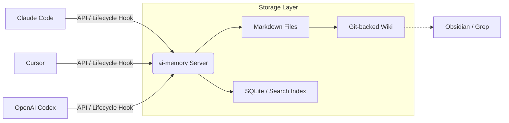

어제는 Claude Code로 리팩토링을 하다가 퇴근했고, 오늘은 집에서 Cursor를 켰다. 그런데 이 자식(AI)이 어제 내가 삽질했던 기록을 전혀 모른다. "야, 어제 그 라이브러리 버전 문제 때문에 안 된다고 했잖아!"라고 백날 소리쳐봐야 소용없다. 다시 처음부터 상황 설명하고, 로그 복붙하고... 이 짓을 반복하다 보면 '내가 에이전트를 모시는 건지, 에이전트가 나를 도와주는 건지' 현타가 세게 온다.

솔직히 요즘 AI 코딩 툴들, 다들 자기네가 최고라고 우기지만 치명적인 단점이 하나 있다. 바로 '도구 간의 담장'이다. Claude에서 배운 걸 Cursor는 모르고, 회사 데스크탑에서 하던 맥락은 내 노트북으로 이어지지 않는다. 이 '컨텍스트 파편화' 문제를 해결하겠다고 나온 게 바로 `akitaonrails/ai-memory`다.

*▲ 기술 스택을 새로 도입하기 전과 도입한 후의 모습*

*(짤 설명: '기억해줘...'라고 애원하는 개발자와 '그게 뭔데 씹덕아'라는 표정의 AI 에이전트)*

### 1. 그래서 이게 정확히 뭔데?

한마디로 정의하자면 **"AI 에이전트 전용 외장하드이자 공용 위키"**다. 

기존의 방식은 각 에이전트가 자기만의 DB나 로컬 파일에 기억을 저장했다. 하지만 `ai-memory`는 중간에서 서버 역할을 하며, 다양한 에이전트(Claude Code, Codex, Cursor, Devin 등 20여 종)의 활동 기록을 하나로 통합한다. 

가장 소름 돋는 지점은 **'벤더 간 핸드오프(Handoff)'** 기능이다. Claude Code를 끄면서 "나 여기까지 했음"이라고 기록하면, 다음에 킨 Codex가 그 기록을 이어받아 "아, 아까 그 리팩토링 하다가 DB 커넥션 오류 나서 멈춘 거군요? 제가 이어서 할게요"라고 말할 수 있게 해준다는 거다.

### 2. 아키텍처: 왜 이게 똑똑한가?

이 프로젝트의 구조를 뜯어보면 개발자 취향 저격 포인트가 몇 가지 있다.

1.  **Markdown이 진실의 원천(Source of Truth):** 기억을 이상한 바이너리나 벡터 DB에만 꽁꽁 숨겨두지 않는다. 모든 기록은 일반 `.md` 파일로 저장된다. 즉, 서버가 터져도 내 기억은 `grep`으로 찾을 수 있고, 평소 쓰던 Obsidian으로 열어봐도 된다.
2.  **Zero-LLM 전략:** 메모리를 캡처하고, 검색하고, 인계하는 기본 프로세스에서 LLM 호출을 0으로 줄였다. 쓸데없이 API 비용 태우지 않고 텍스트 매칭과 구조화된 데이터를 활용한다는 뜻이다. 가성비에 미친 시니어 개발자라면 여기서 무릎을 탁 칠 수밖에 없다.
3.  **Rust 기반의 단일 바이너리:** 인프라 설정하느라 반나절 보내는 건 딱 질색인데, 이건 Rust로 짜여 있어서 그냥 바이너리 하나 실행하면 끝이다.

### 3. 실무 관점에서의 팩트 체크

이게 단순히 "기억력이 좋다" 수준에서 끝날 일일까? 아니다. 협업 관점에서 보면 꽤 파괴적이다.

*   **팀 단위 지식 공유:** 팀원 전체가 하나의 `ai-memory` 서버를 바라보게 설정하면, 동료가 AI랑 삽질하면서 얻은 교훈을 내 AI 에이전트도 실시간으로 습득한다. 
*   **프라이버시 경계:** 무지성으로 다 저장하는 게 아니라, 타입 정의된 경계(Typed privacy boundary)에서 민감한 정보를 거르고 저장한다. 회사 보안 팀이랑 싸울 일 하나 줄여주는 디테일이다.
*   **감사 로그(Audit Log):** AI가 내 코드를 어떻게 주물럭거렸는지, 어떤 프롬프트가 먹혔는지 히스토리가 남는다. "누가 코드를 이따위로 짰어?"라고 물었을 때 "아, 그건 어제 Claude가..."라고 확실히 덤터기를 씌울 수(아니, 원인을 파악할 수) 있다.

*▲ 기술 스택을 새로 도입하기 전과 도입한 후의 모습*

*(짤 설명: 'Memory Found!'라며 환호하는 로봇과 그 뒤에서 안도의 한숨을 내쉬는 개발자)*

### 4. 기존 기술과 뭐가 다른데?

혹자는 말할 거다. "그냥 RAG(Retrieval-Augmented Generation) 쓰면 되는 거 아님?" 

틀린 말은 아니지만, 결이 다르다. RAG는 보통 '문서'를 찾아주는 데 집중한다면, `ai-memory`는 **'작업의 흐름(Workflow Flow)'**을 유지하는 데 집중한다. 
- 시도했던 접근법 중 실패한 것들
- 현재 해결되지 않은 의문점(Open Questions)
- 다음 스텝에 대한 명시적 가이드

이걸 에이전트가 알아서 정리하고 다음 녀석에게 넘겨준다는 게 핵심이다. 컨벤션(Convention)이 아니라 프로토콜(Protocol)로 풀었다는 점이 이 프로젝트의 진짜 가치다.

### 5. 한 줄 총평

**"AI 에이전트를 '도구'에서 '동료'로 업그레이드하고 싶다면 반드시 깔아야 할 미들웨어."**

그래서 내 프로젝트에 쓸 거냐고? 
솔직히 말하면, 아직은 설정하는 게 조금 귀찮긴 하다. 하지만 AI 툴을 3개 이상 스왑해가며 쓰는 '헤비 에이전트 유저'라면, 이건 선택이 아니라 생존의 문제다. 기억 못 하는 AI랑 매일 아침 통성명하기 싫으면 일단 찍먹부터 해보길 권한다. 

아, 참고로 Rust 1.95 이상 버전 필수다. 설치하다 에러 나면 환경 변수부터 체크해라. 이상!