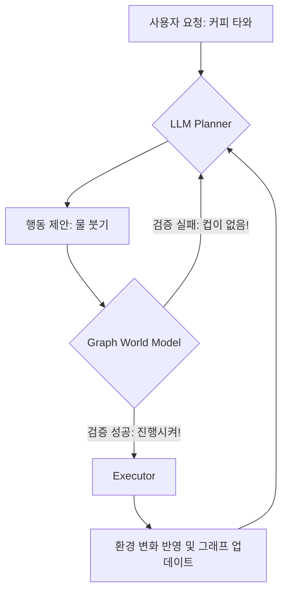

커피 한 잔 타오라고 시켰더니 주방을 난장판으로 만들어놓는 에이전트를 보고 있으면 뒷목이 당긴다. 분명 "컵을 잡고, 물을 붓고, 섞어라"라고 단계별로 알려줬는데, 이 녀석은 컵도 안 집어 들고 허공에 물을 붓는 '할루시네이션 퍼포먼스'를 선보인다. LLM이 똑똑해졌다고는 하지만, 물리적인 제약이 있는 '현실 세계'나 '복잡한 롱 호라이즌(Long-horizon) 태스크' 앞에선 여전히 나사 빠진 소리를 한다. 

오늘 소개할 **GAVEL(Graph World Models for Verified and Efficient Long-Horizon LLM Task Planning)**은 바로 이런 에이전트의 '능지' 문제를 해결하겠다고 나온 물건이다. 겉만 번지르르한 프롬프트 엔지니어링이 아니라, 그래프 구조로 세계관을 박아버리는 접근법이다.

### LLM은 왜 자꾸 헛스윙을 할까?

전통적인 LLM 기반 에이전트의 문제는 '계획'과 '검증'이 따로 논다는 거다. "이거 해봐"라고 하면 "네!" 하고 일단 뱉고 보는데, 그 과정에서 물리적인 인과관계(Affordance)를 무시하기 일쑤다. 예를 들어, 문을 열지도 않고 "방에 들어간다"는 계획을 세우는 식이다. 

*▲ 기술 스택을 새로 도입하기 전과 도입한 후의 모습*

*(설명: 계획은 완벽하지만 현실은 시궁창인 개발자/로봇 짤)*

기존에는 이걸 해결하려고 ReAct나 Reflexion 같은 방식을 썼다. 하지만 이건 실행해보고 "어? 안 되네?" 하고 다시 시도하는 방식이라 너무 느리고 비효율적이다. API 비용은 누가 낼 건데? 우리 사장님이? 아니면 내 지갑이?

### GAVEL: "그래프로 지도를 그려줄게, 헛소리 금지야"

GAVEL의 핵심 아이디어는 **'그래프 세계 모델(Graph World Model)'**이다. 환경의 상태와 가능한 행동을 그래프 노드와 엣지로 정의한다. 

1. **그래프 기반 상태 추상화**: 현재 환경에서 가능한 모든 상태를 그래프로 구조화한다. 
2. **검증된 계획(Verified Planning)**: LLM이 다음 행동을 제안하면, 그래프 모델이 "잠깐, 지금 상태에서 그 행동이 가능해?"라고 즉시 검증한다. 
3. **효율적 탐색**: 단순히 텍스트로만 생각하는 게 아니라, 그래프 경로를 따라가며 최적의 루트를 찾는다.

작동 아키텍처를 대략 그려보면 이렇다.

### 왜 이 방식이 '물건'인가?

GAVEL이 기존 방식과 차별화되는 지점은 **'검증(Verification)'의 시점**이다. 

대부분의 에이전트는 일단 사고를 치고(Action) 나서 환경으로부터 피드백을 받는다. 하지만 GAVEL은 사고를 치기 직전에 **세계 모델(Graph)** 내에서 시뮬레이션을 돌려본다. 

- **정확도**: 물리적 제약 조건을 그래프 엣지로 박아놨기 때문에, '열리지 않은 문 통과하기' 같은 멍청한 실수를 원천 봉쇄한다.
- **속도**: LLM한테 "이게 말이 되니?"라고 물어보는 대신, 그래프 탐색(BFS/DFS 혹은 휴리스틱)으로 처리하니 훨씬 빠르다.
- **장기 계획(Long-horizon)**: 단계가 20단계, 30단계가 넘어가면 LLM은 앞 내용을 까먹기 시작하는데, 그래프는 망각이 없다. 

*▲ 릴리즈 5분 전 긴급 핫픽스 상황*

*(설명: 100줄짜리 if-else 문을 쓰다가 그래프 DB를 도입하고 평화를 찾은 개발자 짤)*

### 벤치마크 결과가 말해주는 팩트

논문에 따르면 GAVEL은 기존의 ReAct나 단순 Zero-shot 프롬프팅보다 성공률(Success Rate) 면에서 압도적인 성능을 보였다. 특히 태스크의 단계가 길어질수록(Long-horizon) 격차는 더 벌어진다. 

단순히 성공만 하는 게 아니라, 목표에 도달하기까지의 '스텝 수'도 훨씬 적다. 즉, 최적의 경로를 찾아낸다는 소리다. 토큰 아껴서 부자 되겠다는 의지가 엿보인다.

### 실무자 입장에서 본 한계와 가능성

물론 장밋빛 미래만 있는 건 아니다. 
- **그래프 구축 비용**: 환경을 그래프로 추상화하는 작업 자체가 또 다른 일이다. 동적인 환경에서 그래프를 실시간으로 업데이트하는 오버헤드를 어떻게 감당할지가 관건이다.
- **도메인 의존성**: 서비스마다 세계 모델을 새로 정의해야 할 수도 있다. 범용 '세계 모델'이 나오기 전까지는 특정 도메인(물류 창고 로봇, 특정 소프트웨어 자동화 등)에서 먼저 빛을 발할 것 같다.

그럼에도 불구하고, GAVEL은 "LLM은 통계적인 앵무새일 뿐이다"라는 비판을 정면으로 돌파한다. LLM의 창의적인 추론 능력과 그래프의 엄격한 논리를 결합했다는 점에서 아주 영리한 접근이다.

### 한 줄 총평

**"에이전트한테 제발 '생각' 좀 하고 움직이라고 빌 시간에, 그냥 GAVEL 같은 족쇄(그래프)를 채우는 게 정신 건강에 이롭다."**

조만간 내 사이드 프로젝트 에이전트에도 이 구조를 얹어봐야겠다. 자꾸 DB 커넥션도 안 맺고 쿼리 날리겠다는 소리 좀 안 듣게 말이다. 끝.