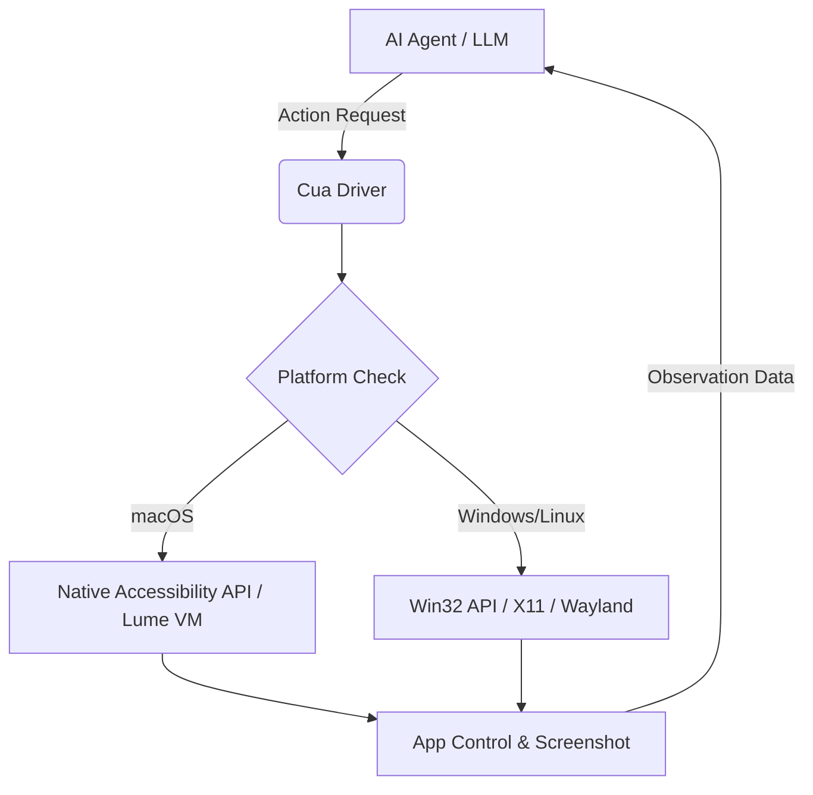

GitHub Trending을 보다가 간만에 뒷목 잡을 뻔했다. 또 'Computer Use' 타령이다. 솔직히 말해보자. 클로드(Claude)가 처음 이 기능을 내놨을 때, 우리 다들 "오, 이제 메일 보내고 지라(Jira) 티켓 끊는 거 AI가 해주겠네?"라며 설레지 않았나? 근데 막상 써보면 어때. 스크린샷 하나 찍고 10초 멍 때리다가 엉뚱한 버튼 클릭하고... 속 터져서 내가 직접 마우스 잡는 게 일상이다.

그런데 이번에 등장한 **trycua/cua**는 결이 좀 다르다. 단순히 "AI가 화면을 보고 클릭한다" 수준을 넘어서, 아예 OS 레벨에서 에이전트가 뛰어놀 수 있는 '인프라'를 통째로 깔아버리겠다는 야심이 느껴진다. 오늘은 이 녀석이 왜 단순한 래퍼(Wrapper)가 아닌지, 그리고 우리 같은 시니어 개발자들이 왜 이걸 주목해야 하는지 뼛속까지 파헤쳐 보겠다.

## 1. 껍데기만 AI가 아니다: Cua의 아키텍처

기존의 Computer Use가 '브라우저 안에서 꼼지락거리는 수준'이었다면, Cua는 OS라는 거대한 생태계를 AI가 지배할 수 있도록 다리를 놓는다. 핵심은 크게 세 가지다: **Cua Driver**, **Cua Fleets**, 그리고 **Lume**.

이게 왜 중요하냐면, AI 에이전트가 네이티브 앱(Slack, VS Code, Excel 등)을 제어하려면 단순히 '이미지 인식'만으로는 한계가 명확하기 때문이다. 버튼이 살짝만 가려져도 바보가 되거든. Cua는 접근성(Accessibility) 트리와 드라이버 레벨의 제어를 결합해서 AI가 "아, 이게 클릭 가능한 확인 버튼이구나"라는 걸 픽셀이 아니라 데이터로 이해하게 만든다.

*▲ 분명 로컬에선 잘 돌아갔는데...?*

*(짤 설명: "This is fine" 강아지가 불타는 집 대신, AI 에이전트가 내 운영체제 설정을 멋대로 바꾸고 있는 모니터를 바라보며 흐뭇해하는 짤)*

## 2. 왜 굳이 'Cua Fleets'라는 격리 공간이 필요한가?

개발자라면 본능적으로 이런 생각이 들 거다. "내 메인 맥북의 마우스 제어권을 이름도 모르는 오픈소스 에이전트한테 준다고? 미쳤어?" 

Cua 형들은 이 지점을 정확히 짚었다. 그래서 **Cua Fleets**와 **Lume**이 나온 거다.
- **Lume**: Apple Silicon 기반에서 로컬 macOS VM을 띄워버린다. 내 본체랑 격리된 가상 환경에서 AI가 마음껏 삽질하게 두는 거다.
- **Cua Fleets**: 클라우드 기반의 격리된 데스크톱 환경이다. API 호출 한 번으로 에이전트 전용 PC를 대량으로 뽑아낼 수 있다.

이건 확장성 측면에서 괴물 같은 장점이다. 내가 짠 에이전트 100개가 동시에 서로 다른 PC 환경에서 엑셀을 돌리고 이메일을 보낸다고 상상해 봐라. 이건 더 이상 장난감이 아니라 '디지털 노동력'의 플릿(Fleet)을 구축하는 셈이다.

## 3. CUA-S1: "생각은 짧게, 행동은 정확하게"

Cua가 영리한 건 모델 전략에서도 드러난다. 얘네는 모든 걸 GPT-4나 Claude 3.5 Sonnet 같은 무거운 모델에 맡기지 않는다. **CUA-S1**이라는 특화된 소형 모델을 들이밀었다.

- **문제**: 거대 모델은 화면 전체를 이해하는 데 너무 많은 토큰을 쓰고 느리다.
- **해결**: S1은 'Computer Use'라는 특정 태스크, 즉 좌표 계산과 요소 인식에 최적화되어 있다. 

이게 실무에서 왜 중요하냐면, 마우스 클릭 한 번에 5초씩 걸리면 서비스로 못 쓴다. Cua는 특화 모델을 통해 레이턴시를 줄이고 정확도를 높이는 정공법을 택했다. 벤치마크 결과? 뭐, 자기들이 만든 거니까 당연히 좋게 나오겠지만, 구조적으로 '전문가 모델'을 따로 둔 건 확실히 박수 쳐줄 만한 선택이다.

## 4. 기존 기술과 뭐가 다른데? (Playwright vs Cua)

혹자는 "그거 그냥 Playwright나 Selenium으로 브라우저 자동화하면 되는 거 아님?"이라고 묻는다. 미안하지만 그건 유치원생이랑 대학생을 비교하는 수준이다.

1.  **범위**: Playwright는 브라우저라는 샌드박스에 갇혀 있다. Cua는 OS 전체다. 슬랙 알림을 읽고, 터미널을 열어 빌드를 돌리고, 결과를 엑셀에 붙여넣는 게 가능하다.
2.  **유연성**: 셀레늄은 돔(DOM) 구조가 조금만 바뀌어도 터진다. Cua의 드라이버 기반 접근 방식은 시각 정보와 접근성 데이터를 버무려서 훨씬 유연하게 대응한다.

*▲ 코드가 왜 돌아가는지 아무도 모를 때*

*(짤 설명: 고전적인 셀레늄 코드가 0.1초 만에 깨지는 모습과, 여유롭게 OS를 활보하는 Cua 에이전트의 대비)*

## 5. 그래서 내 프로젝트에 쓸 거냐고?

솔직히 말하면, **"내일 당장 프로덕션에 박겠다"는 오버다.** 아직 'Computer Use' 자체의 불확실성이 크고, AI가 내 개인 정보를 다루는 환경에서 보안 이슈는 여전히 뜨거운 감자니까.

하지만 **"로컬 개발 도구로는 당장 써보겠다"**는 게 내 결론이다. 특히 반복적인 UI 테스트나, 여러 앱을 넘나드는 귀찮은 워크플로우를 자동화하는 데 이만한 물건이 없다. Lume을 이용해 로컬 VM에서 돌리면 보안 걱정도 덜 수 있고 말이다.

### 한 줄 총평:
**"AI에게 마우스 제어권을 주는 게 공포 영화의 시작일지, 개발자의 낙원일지는 cua의 격리 기술이 얼마나 완벽하냐에 달렸다. 일단 아키텍처는 합격이다."**

자, 이제 `brew install`은 아니고 깃허브 가서 `git clone`부터 때려보자. AI가 내 대신 지라 티켓을 처리해주는 그날까지, 우리네 삽질은 계속될 테니까.