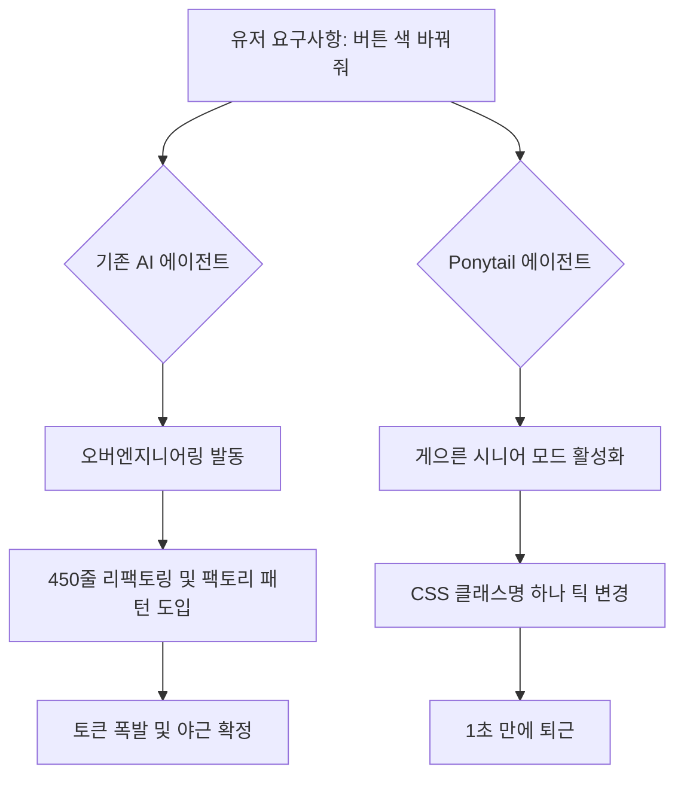

또 새로운 도구가 나왔다. 솔직히 처음엔 '또 뭔 신기술이야, 챗gpt 껍데기 하나 또 바꿨겠지' 싶었다. 깃허브 트렌딩을 무심코 내리다가 `DietrichGebert/ponytail`이라는 레포를 발견하기 전까지는 말이다. 

슬로건을 보는 순간 심장이 쿵 내려앉았다.
> *"He says nothing. He writes one line. It works."*
(말은 없지. 한 줄만 쓰지. 근데 작동하지.)

이거 완전 우리 팀에서 제일 일 안 하는 것 같은데 핵심만 쏙쏙 골라 처리하고 칼퇴하는 그 전설의 10년 차 시니어 사내 모습이잖아? AI가 이제는 인간의 '성실함'을 모방하는 걸 넘어, '전략적인 게으름'까지 학습하기 시작했다는 뜻이다. 도대체 이 녀석이 뭔지 파헤쳐 보자.

---

### 1. 왜 AI는 항상 굳이 없어도 될 코드를 오백 줄씩 짜는가?

우리가 평소에 쓰는 AI 코딩 에이전트(Claude Code라든가 Cursor라든가)를 생각해 보자. 뭐 하나 고쳐달라고 하면 자상하기가 아주 조상님 수준이다. 

"사용자님의 요구사항을 반영하여, 예외 처리와 확장성을 고려한 450줄짜리 팩토리 패턴 구조를 생성했습니다! 테스트 코드도 3개 추가했고요!"

*▲ 기술 스택을 새로 도입하기 전과 도입한 후의 모습*

> *개발자: "아니 버튼 색깔 하나 바꾸랬잖아. 왜 컴포넌트를 싹 다 갈아엎는데?"*

AI는 본질적으로 '열정 과다' 상태다. 프롬프트에 아무 말 안 하면 자기가 가진 토큰을 풀로 활용해서 세상 화려하고 복잡한 엔터프라이즈급(사실은 오버엔지니어링의 극치인) 코드를 뱉어낸다. 그리고 우리는 그 코드를 보며 한숨을 쉬고, `git checkout .`을 누른 뒤 "한 줄만 고쳐달라고!"를 외치며 다시 프롬프트를 치곤 한다.

`ponytail`은 정확히 이 지점을 저격한다. AI에게 "성실한 모범생" 대신 **"할 일만 하고 짱박히는 노련한 시니어"**의 페르소나를 장착시키는 것이다.

---

### 2. 포니테일의 아키텍처: 어떻게 게으름을 시스템화했는가?

이 녀석이 단순한 농담조의 프롬프트 쪼가리라고 생각하면 오산이다. 공식 벤치마크 데이터를 보면 숫자가 꽤 진지하다.

- **코드 양**: 평균 **54% 감소** (최대 94%까지 줄어듦. 예를 들어 달력 컴포넌트 같은 걸 구현할 때 오버빌딩하는 걸 칼같이 차단함)
- **비용**: 약 **20% 절감** (토큰을 적게 쓰니까 당연함)
- **속도**: 약 **27% 향상**
- **안전성**: 보안 가드레일은 100% 유지 ("한 줄만 써라"고 했다가 보안 취약점까지 대충 짜는 대참사는 막음)

이게 가능한 이유는 에이전트 레이어에서 불필요한 사족을 제거하고, "최소한의 변경으로 목적을 달성하라(Minimal Viable Change)"는 철학을 시스템 프롬프트와 컨텍스트 제어로 강제하기 때문이다.

구조를 대략 그려보면 이렇다.

원리는 단순하지만 개발 현장에서 피부로 와닿는 임팩트는 어마어마하다. 복잡하게 꼬인 레거시 코드베이스에서 AI가 파일을 20개씩 건드려가며 버그를 양산하는 꼴을, 이 녀석은 원천 차단한다. 건드릴 필요 없는 코드는 아예 쳐다보지도 않는다. 진정한 '고수의 무심함'이다.

---

### 3. 실무에서 써본 느낌과 팩폭

이 툴을 Claude Code 세션에 연동해서 FastAPI + React 프로젝트에 굴려봤다. 

확실히 다르다. 평소 같으면 날새며 수정사항을 반영하느라 토큰이 쫙쫙 닳고 제3자의 눈으로 봤을 때 "이게 왜 들어가 있지?" 싶은 템플릿 코드들이 생기기 마련인데, ponytail을 적용한 에이전트는 딱 diff가 깔끔하게 떨어진다. 

*▲ 분명 로컬에선 잘 돌아갔는데...?*

> *PR 리뷰어: "이번 PR 왜 이렇게 깔끔함? 너 오늘 컨디션 좋냐?"*
> *나: "아니, AI가 일 안 하려고 잔머리 좀 굴렸어."*

물론 단점이 아예 없는 건 아니다. 가끔은 너무 요약해서 짜는 바람에 "잠깐, 여기 예외 처리는 안 넣냐?" 하고 인간 시니어가 다시 코드를 들여다봐야 할 때가 있다. 하지만 생각해 보자. AI가 싸놓은 똥을 치우는 것보다, 차라리 최소한의 코드를 보고 필요한 부분만 덧붙이는 게 정신 건강에 백배 이롭다.

---

### 결론

오픈소스 세상은 참 재미있다. 기술이 발전할수록 우리는 더 똑똑하고, 더 거대하고, 더 복잡한 에이전트를 만들려고 혈안이 되어 있었는데, 문득 어떤 개발자가 **"AI한테 그냥 일하기 싫어하는 시니어 영혼을 불어넣으면 어떨까?"**라는 미친 생각을 해냈고, 그것이 대박이 났다.

그래서 내 프로젝트에 쓸 거냐고? 솔직히 말하면, 이미 내 로컬 환경에 깔아뒀다. 팀원들 몰래 나만 써서 칼퇴하는 비밀 무기로 삼기에 이보다 더 완벽할 순 없다.

**한 줄 총평:**
말은 없지만, 잔머리 하나는 예술이라 결국 코드를 살리는 최고의 게으름뱅이 비서.