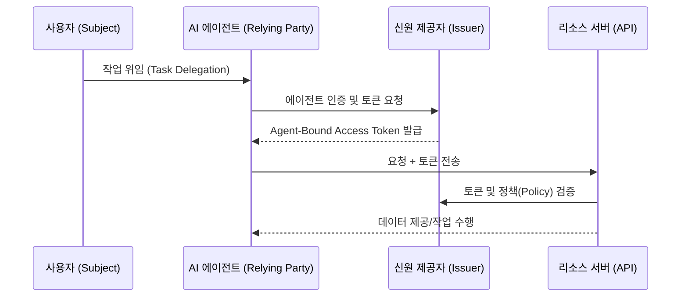

AI 에이전트가 유행이란다. 이제는 단순히 "오늘 날씨 어때?"라고 묻는 수준을 넘어서, "내 다음 여행 계획 짜고 비행기랑 호텔까지 다 결제해 줘"라고 시키는 시대다. 그런데 여기서 잠깐, 소름 돋는 생각 하나 안 드나? 

이 AI 녀석이 도대체 '나'라는 걸 어떻게 증명하고 내 지갑을 연다는 걸까? 내가 준 API 키 하나로 온 사방을 들쑤시고 다니게 내버려 둬도 괜찮은 걸까? 

최근 OpenID Foundation에서 발표한 **[Identity Management for Agentic AI]** 백서를 읽다가 무릎을 탁 쳤다. 아니, 사실은 뒷목을 좀 잡았다. 우리가 그동안 OAuth 2.0이니 OIDC니 하면서 쌓아 올린 신원 인증의 탑을 에이전트라는 녀석들이 아주 가볍게 무너뜨리려 하고 있거든.

## 1. 지금 우리 방식이 왜 문제냐고?

지금까지의 인증(Authentication)은 철저히 '인간' 중심이었다. 브라우저에 팝업이 뜨면 우리가 아이디, 비번을 치거나 지문을 찍었다. 하지만 자율형 에이전트(Agentic AI)는 다르다. 얘네는 우리가 잘 때도 돌아가고, 지들끼리 통신하며 의사결정을 내린다.

기존 방식대로 에이전트한테 내 `Access Token`을 통째로 넘겨주는 건, 마치 낯선 심부름꾼한테 내 집 도어락 번호랑 인감도장을 통째로 맡기는 거나 다름없다. 에이전트가 해킹당하거나, 코드가 꼬여서 내 클라우드 인프라를 다 날려 먹으면? 책임은 고스란히 내 몫이다.

*▲ 분명 로컬에선 잘 돌아갔는데...?*

*(설명: "Just give it the Admin API Key"라고 말하는 개발자와 경악하는 보안 담당자 짤)*

## 2. OpenID Foundation이 제시하는 해결책: 에이전트에게 '신분증'을

백서의 핵심은 간단하다. **"에이전트 자체도 하나의 신원(Identity)으로 정의하자"**는 거다. 단순히 사용자의 권한을 대리 수행하는 '도구'가 아니라, 독립적인 주체로서 인증을 받아야 한다는 뜻이다.

이들이 제안하는 구조를 대략적으로 그려보면 이렇다.

여기서 중요한 포인트는 **'Dynamic Client Registration'**과 **'Short-lived Tokens'**다. 

1.  **동적 등록**: 에이전트가 생성될 때마다 실시간으로 신분증을 발급받는다. 
2.  **용도 제한**: "이 토큰은 30분 동안 '항공권 예약'에만 쓸 수 있음" 같은 아주 좁은 범위(Scope)의 권한만 부여한다.
3.  **검증 가능성**: 이 에이전트가 어떤 LLM을 쓰는지, 어떤 보안 수준을 갖췄는지 증명서(Attestation)를 포함한다.

## 3. 기술적으로 깊게 들어가면: "나만 쓸 수 있는 토큰"

백서에서 강조하는 기술 중 하나가 **DPoP (Demonstrating Proof-of-Possession)**다. 기존 Bearer 토큰은 훔치기만 하면 누구나 쓸 수 있었지만, DPoP을 쓰면 토큰과 특정 개인키를 묶어버린다. 에이전트가 토큰을 탈취당해도, 그 에이전트의 '열쇠'가 없으면 쓸모없는 쓰레기 데이터가 된다는 소리다.

또한, **'Federated Identity for Agents'** 개념도 흥미롭다. 예를 들어, 내가 'A 서비스'에서 만든 에이전트가 'B 서비스'의 데이터를 가져올 때, A와 B가 서로 신뢰할 수 있는 표준 프로토콜(OIDC 확장판 등)을 통해 에이전트의 신원을 보증해 주는 방식이다.

## 4. 그래서 이게 왜 중요한데?

솔직히 말해보자. 우리 개발자들, 귀찮으면 `chmod 777` 때리고 `sudo` 남발하잖아? AI 에이전트 개발할 때도 똑같은 짓을 할 가능성이 99%다. 

하지만 에이전트가 '자율성'을 갖는 순간, 보안 사고의 스케일이 달라진다. 내가 시키지도 않은 람보르기니를 에이전트가 결제했다고 생각해보라고(물론 그럴 잔고는 없겠지만). 

OpenID Foundation의 이 백서는 단순히 기술 표준을 만들자는 게 아니라, **"AI에게 어디까지 권한을 줄 것인가?"**에 대한 거버넌스를 코드로 구현하자는 선언이다.

*▲ 릴리즈 5분 전 긴급 핫픽스 상황*

*(설명: 복잡한 OAuth 흐름도를 보며 "I just wanted to automate a spreadsheet"라고 울먹이는 개발자 짤)*

## 마무리: 내 프로젝트에 쓸 거냐고?

솔직히 지금 당장 실무에 적용하기엔 아직 프로토콜이 구체화되어야 할 부분이 많다. 하지만 조만간 엔터프라이즈 급 AI 솔루션을 만든다면 이 가이드라인은 선택이 아닌 필수(Must-have)가 될 거다. 

**한 줄 총평:**
에이전트한테 내 계정 비번 알려주던 '야만적 시대'는 끝났다. 이제 AI도 주민등록증 들고 다녀야 하는 시대다.

혹시 지금 에이전트 만들면서 `OPENAI_API_KEY`랑 서비스 계정 키를 하드코딩하거나 통째로 넘겨주고 있다면? 축하한다. 당신은 미래의 보안 사고 주인공 후보 1순위다. 얼른 이 백서 한 번 쓱 훑어보길 바란다. 

---
*참고: 더 자세한 내용이 궁금하면 [OpenID Foundation 백서 원문](https://openid.net/wp-content/uploads/2025/10/Identity-Management-for-Agentic-AI.pdf)을 직접 파보자. 영어지만 개발자라면 그림만 봐도 대충 감이 올 거다.*