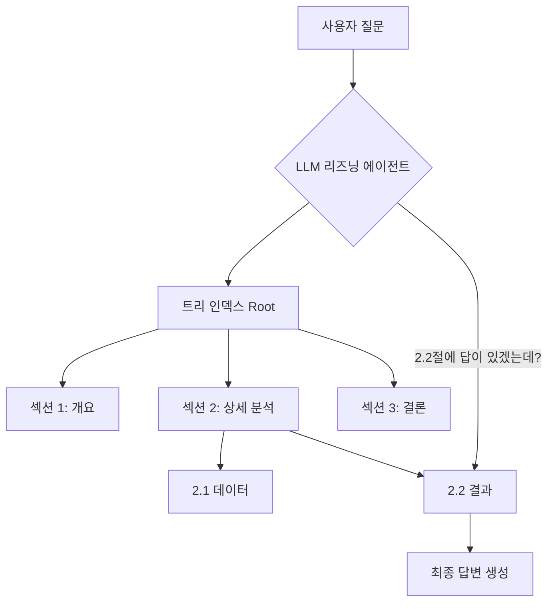

어제도 새벽까지 '청크 사이즈를 512로 할까 1024로 할까' 고민하다가 현타가 왔다. 임베딩 모델 바꾸고, 오버랩 구간 조정하고... 솔직히 말해보자. 우리 다들 RAG(Retrieval-Augmented Generation) 성능 안 나와서 삽질하는 거, 일종의 '기우제' 지내는 마음 아니었나? "제발 유사도 높은 놈이 정답이길!" 하면서 말이다.

그런데 오늘 깃허브 트렌딩에서 아주 발칙한 놈을 발견했다. 이름은 **PageIndex**. 이 녀석의 슬로건이 아주 가관이다. **"Vectorless(벡터 없음), No Chunking(청킹 안 함)".** 

아니, RAG에서 벡터랑 청킹을 빼면 뭐가 남지? 앙꼬 없는 찐빵 아닌가? 궁금해서 뜯어봤더니, 이건 찐빵이 아니라 아예 스테이크를 구워왔더라.

---

### 유사도(Similarity)는 정답(Relevance)이 아니다

우리가 그동안 믿어 의심치 않았던 벡터 기반 RAG의 치명적인 약점은 바로 '유사도'에만 집착한다는 거다. 예를 들어, "작년 대비 매출이 얼마나 늘었어?"라고 물으면, 기존 RAG는 '매출', '증가' 같은 단어가 많이 포함된 문단을 가져온다. 

하지만 진짜 정답은 "매출은 10억인데, 작년엔 8억이었으니 25% 늘었다"는 식의 맥락 파악이 필요한 데이터일 확률이 높다. 벡터 검색은 이 맥락을 모른다. 그냥 숫자랑 단어가 비슷하면 냅다 던져줄 뿐이다.

*▲ 메모리 누수 잡으려다가 OS까지 날려먹을 뻔한 개발자*

*(짤 설명: "Why are you searching like this?"라고 묻는 상사와 "Because the vector says so"라고 답하며 울고 있는 개발자)*

PageIndex는 여기서 발상의 전환을 한다. **"인간은 문서를 벡터로 안 읽잖아? 목차 보고, 훑어보고, 필요한 부분을 찾아 읽지."** 

### PageIndex의 핵심: AlphaGo 스타일의 트리 검색

PageIndex는 문서를 벡터 공간에 뿌리는 대신, 문서 전체를 **계층형 트리(Hierarchical Tree)** 구조로 인덱싱한다. 그리고 여기에 LLM을 태워 보낸다. 

원리는 단순하지만 강력하다.
1. **Index**: 문서를 읽고 의미 단위로 계층 구조를 만든다. (PageIndex Flash라는 기술로 겁나 빠르게 만든단다.)
2. **Retrieve**: 질문이 들어오면 LLM 에이전트가 트리를 타고 내려간다. "이 질문은 3장 재무제표 쪽에 답이 있겠군? 3.2절로 가보자." 하는 식이다.

이 과정을 Mermaid 다이어그램으로 그려보면 대략 이렇다.

이게 왜 대단하냐면, **'맥락(Context)'**을 유지한 채로 정보를 찾는다는 거다. 벡터 RAG처럼 문장을 조각조각(Chunking) 내서 의미를 파편화하지 않는다.

---

### 벡터 DB 없으면 진짜 편할까?

PageIndex의 기술 스택을 보면 개발자 입장에서 무릎을 탁 치게 되는 포인트가 몇 가지 있다.

*   **No Vector DB**: 파인콘(Pinecone)이니 밀버스(Milvus)니 설정하고 관리할 필요가 없다. 인프라 복잡도가 수직 하락한다.
*   **Reasoning-based**: 단순히 '비슷한' 문장이 아니라, 질문의 의도를 파악해서 '관련 있는' 노드를 찾아간다. 
*   **Local & Cloud**: `pip install pageindex` 한 줄로 로컬에서도 돌릴 수 있고, 클라우드 API로 확장도 된다.

물론 세상에 공짜는 없다. 모든 노드를 LLM이 판단하며 내려가야 하니, 단순 벡터 검색보다는 **레이턴시(Latency)**와 **비용**이 더 들 수밖에 없다. 하지만 100번 틀린 대답을 0.1초 만에 내놓는 것보다, 2초 걸려도 정확한 정답을 내놓는 게 중요한 비즈니스 환경이라면? 이건 게임 체인저다.

*▲ 기술 스택을 새로 도입하기 전과 도입한 후의 모습*

*(짤 설명: 고속도로에서 'Fast but Wrong' 출구와 'Slow but Right' 출구 중 'Slow but Right'로 급커브 트는 자동차)*

---

### 직접 써보니 어떤가? (Technical Deep Dive)

최근 업데이트된 `PageIndex SDK`를 써보니, 로컬 모드에서 자기들만의 `PageIndex Flash`라는 엔진을 쓰는데 이게 물건이다. 텍스트 기반 PDF를 읽어서 트리 구조로 만드는 속도가 꽤나 빠릿하다. 

특히 'PageIndex File System'이라는 개념을 도입해서 문서 한 권이 아니라 수백, 수천 권의 문서 더미 위에서도 트리 구조로 리즈닝을 수행한다. 이건 마치 기업 내부 위키나 문서 저장소 전체를 하나의 거대한 뇌처럼 쓰겠다는 야심이다.

---

### 한 줄 총평

**"RAG 성능 안 나와서 샷건 치던 시절은 이제 끝났다. 벡터의 시대가 가고 리즈닝의 시대가 오고 있다."**

솔직히 말하면, 모든 서비스에 PageIndex를 쓸 필요는 없다. 단순한 FAQ 봇이라면 기존 벡터 RAG로 충분하다. 하지만 전문적인 리포트 분석, 복잡한 계약서 검토, 혹은 롱폼(Long-form) 문서를 다루는 프로젝트를 하고 있다면? 

당장 `pip install pageindex` 해봐라. 어쩌면 그동안 당신을 괴롭히던 '청크 사이즈 최적화'의 지옥에서 탈출할 유일한 비상구일지도 모르니까. 나? 나는 이미 내 개인 프로젝트 문서 인덱스를 이걸로 갈아치우는 중이다. 끝.