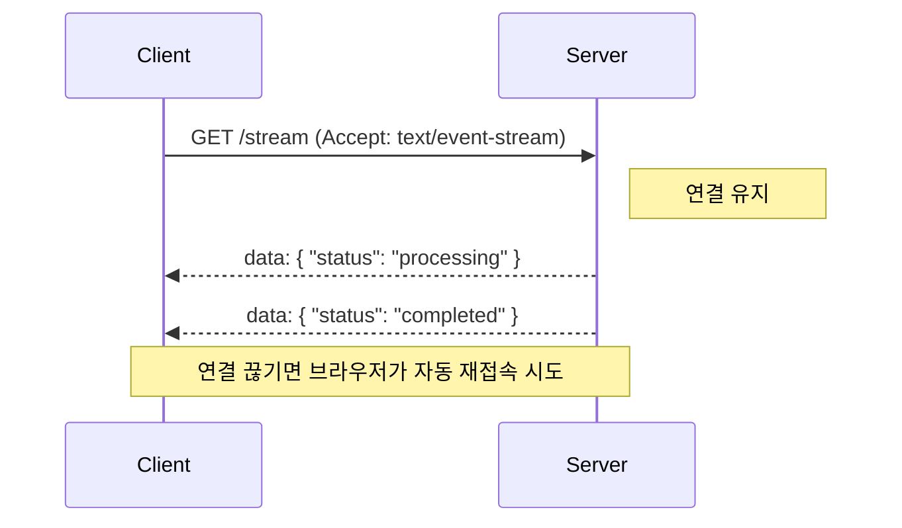

어제 신입 개발자가 올린 PR을 보다가 뒷목을 잡았다. 단순한 파일 업로드 완료 알림 기능을 만드는데 `Socket.io` 라이브러리부터 임포트하고 있더라고. "왜 소켓을 썼어?"라고 물으니 돌아온 대답이 가관이다. "실시간이니까요."

이봐, 친구. 실시간이라는 단어에 낚여서 무조건 소켓부터 박는 건, 파리 잡겠다고 에프킬라 대신 K2 소총을 들고 오는 격이다. 오늘은 우리가 '실시간'이라는 달콤한 단어 뒤에 숨겨진 통신 방식들을 어떻게 골라 써야 하는지, 시니어의 짬바를 담아 탈탈 털어보겠다.

### 실시간? '얼마나' 빨라야 하는데?

공학에서 말하는 **실시간(Real-time)**은 단순히 "존나 빠름"을 의미하지 않는다. 핵심은 **마감 시간(Deadline)** 안에 결과가 도착하느냐다. 

- **Hard Real-time**: 1ms라도 늦으면 시스템이 터지는 상황 (자율주행, 미사일 제어). 브라우저에선 거의 볼 일 없다.
- **Soft Real-time**: 좀 늦으면 사용자 기분은 잡치겠지만, 시스템은 돌아가는 상황 (채팅, 알림). 우리가 다루는 대부분이 이거다.

여기서 중요한 건 '지연 시간(Latency)'과 '최신성(Freshness)'의 구분이다. 0.1초 만에 데이터가 왔어도 그게 1분 전 데이터면 아무 소용 없잖아?

*▲ 코드가 왜 돌아가는지 아무도 모를 때*

*(짤 설명: "Why are you using WebSockets for a static notification?" 템플릿에 당황하는 개발자 짤)*

---

### 1. 폴링(Polling) & 롱 폴링(Long Polling) - "갔어? 아니? 갔어? 아니?"

가장 원시적이지만, 의외로 생명력이 끈질기다. 

- **Polling**: 5초마다 서버에 "야, 뭐 바뀐 거 있냐?"라고 묻는 거다. 서버가 "없어"라고 해도 5초 뒤에 또 묻는다. HTTP 오버헤드가 크고 리소스 낭비가 심하다.
- **Long Polling**: 질문을 던지고 서버가 "잠깐만, 바뀔 때까지 기다려"라며 연결을 잡고 있는다. 뭔가 바뀌면 그때 응답을 주고 연결을 끊는다.

**언제 쓰나?** 
상태 변경이 아주 가끔 일어나고, 인프라 세팅하기 귀찮을 때. 혹은 구닥다리 브라우저까지 지원해야 하는 눈물 나는 상황일 때 쓴다.

---

### 2. SSE (Server-Sent Events) - "나는 말할 테니 너는 듣기만 해"

내 최애 기술 중 하나다. 서버에서 클라이언트로 단방향 스트리밍을 쏘는 방식이다. 

- **특징**: HTTP 프로토콜을 그대로 쓴다. 재연결(Reconnection) 로직이 브라우저에 내장되어 있다. 가볍다.
- **치명적 단점**: 단방향이다. 클라이언트가 서버에 뭘 보내려면 별도의 HTTP 요청을 날려야 한다.

---

### 3. WebSocket - "풀-듀플렉스 양방향 아우토반"

모두가 사랑하지만, 관리하기는 지랄맞은 녀석이다. 

- **특징**: 한 번 연결되면(Handshake) 양방향으로 데이터를 막 던질 수 있다. HTTP가 아니라 Binary 프로토콜이라 헤더도 가볍다.
- **현실**: 로드밸런서 설정(Sticky Session), 좀비 커넥션 관리, 하트비트(Heartbeat) 체크 등 신경 쓸 게 한두 개가 아니다. 서버 리소스를 꽤나 잡아먹는다.

---

### 연결 끊기면? 상태 복구의 미학

실시간 통신에서 가장 간과하는 게 **"재연결 시 누락된 데이터"**다. 터널 통과하다가 끊겼을 때, 그 사이 발생한 이벤트를 어떻게 채울 건가?

1. **Sequence ID (Last-Event-ID)**: SSE는 이걸 기본으로 지원한다. "나 100번까지 받았어!"라고 말하면 서버가 101번부터 쏴주는 식이다.
2. **Snapshot + Delta**: 재연결되면 일단 현재 전체 상태(Snapshot)를 한 번 긁어오고, 그다음부터 바뀐 것(Delta)만 다시 받는다.

*▲ 코드가 왜 돌아가는지 아무도 모를 때*

*(짤 설명: "Reconnecting..." 무한 루프 돌면서 눈물 흘리는 개발자)*

### 그래서 뭘 써야 하냐고? (시니어의 한 줄 가이드)

솔직히 말해서, 90%의 서비스는 WebSocket이 필요 없다. 내 기준은 이렇다.

1.  **채팅이나 실시간 협업 툴(피그마 같은 거) 만드나?** -> **WebSocket**
2.  **주식 차트나 대시보드, 알림 기능인가?** -> **SSE** 가 답이다. 훨씬 싸고 안정적이다.
3.  **그냥 '작업 완료' 알림 하나 띄우는 건가?** -> **Polling**으로도 충분하다. 유저가 5초 늦게 안다고 세상 안 망한다.

**한 줄 총평:**
신기술이나 '간지'나는 기술에 매몰되지 마라. 가장 좋은 아키텍처는 목적에 맞는 최소한의 기술로 최대의 안정성을 뽑아내는 거다. 소켓 서버 터져서 새벽에 전화 받기 싫으면 SSE부터 검토해라. 알겠냐?